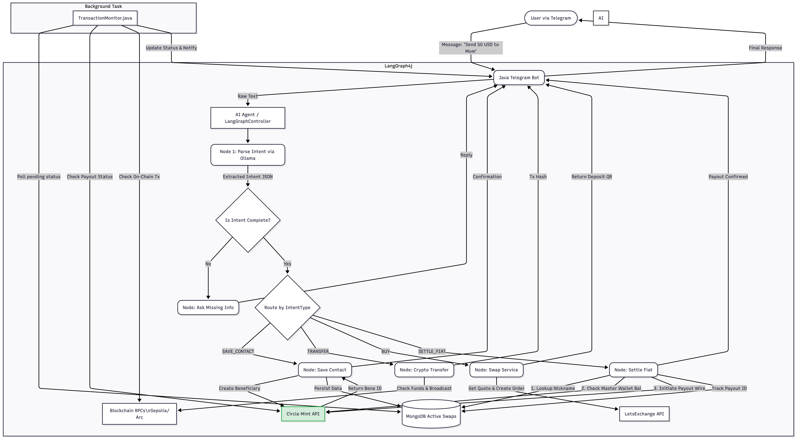

# PayItNow - Crypto & Fiat AI Payment Bot

## Overview

**PayItNow** is an intelligent Telegram chatbot designed to bridge the gap between on-chain crypto assets and traditional fiat banking rails. It uses a locally hosted LLM (Ollama) to understand natural language commands, allowing users to manage crypto wallets, swap tokens across chains, save international bank contacts, and execute fiat wire transfers using the Circle Mint API.

### Key Features
* **Natural Language Interface:** Powered by a custom-trained GGUF model run via Ollama and orchestrated by LangGraph4j.
* **Multi-Chain Support:** Manages assets on Ethereum (Sepolia) and Arc Network.
* **Crypto Swaps:** Integrated with LetsExchange for seamless ETH <-> USDC swaps with minimum amount validation.
* **Fiat Bridge (Off-Ramp):** Integration with **Circle Mint** to send USDC directly to traditional bank accounts via SWIFT/Wire (e.g., Mexico, USA).
* **Contact Management:** Save complex bank details (CLABE, SWIFT) under simple nicknames (e.g., "Mom") for one-click fiat settlement.
* **Real-time Monitoring:** Background service tracks asynchronous blockchain swaps and Circle fiat wire statuses, notifying the user upon completion.

---

## Architecture

The system is built on Java using Spring Boot principles. It relies on a micro-service architecture within a monolithic application block, connecting to various external APIs and decentralized networks.

### Core Components

| Component | Technology | Description |
| :--- | :--- | :--- |
| **Bot Interface** | TelegramBots Java | Handles user messaging and notifications. |
| **AI Engine** | LangChain4j + Ollama | Connects Java to the local LLM for intent classification (JSON output). |
| **Workflow Engine** | LangGraph4j | Manages stateful conversation flows. Determines if an intent is complete or if the bot needs to ask for missing info. |
| **Database** | MongoDB | Stores user wallet creds (encrypted), saved banking contacts, and active transaction logs. |

### Service Layer

* **`WalletService`**: Manages Web3j Credentials and MongoDB interactions for user data and contact lookups.
* **`CryptoService`**: Handles blockchain interactions via RPC (checking native ETH/Arc balances and ERC-20 token balances).
* **`SwapService`**: Interacts with the LetsExchange API. It includes smart caching for network selection and validates quote minimums before allowing an order.
* **`TransactionMonitor`**: A background thread that polls MongoDB for "pending" or "processing" transactions, checks their status against the respective APIs (Blockchain or Circle), and updates the user.

---

## Deep Dive: Circle API Integration (Fiat Rails)

This project uses the **Circle Mint API (Sandbox)**. It is crucial to distinguish this from "Programmable Wallets".

### 1. The Master Wallet Concept
* The bot operates out of a single institutional "Master Wallet" provided by Circle Mint.
* **IMPORTANT:** User funds for fiat settlements must be deposited into this specific Master Wallet address first.
* The bot performs a "Pre-flight Balance Check" on the Master Wallet before attempting any wire transfer. If funds are low, it generates a deposit QR code for the user.

### 2. Beneficiary Management (`SAVE_CONTACT`)
Fiat wires cannot be sent blindly. A recipient must first be registered as a **Wire Beneficiary** with Circle to satisfy compliance.

* **Workflow:** User provides bank details -> Bot calls Circle `POST /v1/businessAccount/banks/wires` -> Circle returns a unique `beneficiary_id`.
* **Storage:** The bot saves this `beneficiary_id` along with a nickname (e.g., "Mom") in MongoDB.
* **ISO/SWIFT compliance:** The code includes normalizers to ensure country codes are ISO 3166-1 alpha-2 (e.g., "Mexico" -> "MX") and validates that SWIFT codes match the country (e.g., using 11-digit branch codes for BBVA Mexico).

### 3. Fiat Settlement (`SETTLE_FIAT`)
* **Workflow:** User says "Send 50 USD to Mom" -> AI extracts nickname and amount.
* **Lookup:** Bot finds "Mom" in MongoDB to retrieve the `beneficiary_id`.
* **Execution:** Bot calls Circle `POST /v1/businessAccount/payouts` moving USDC from the Master Wallet to the beneficiary's bank via wire.
* **Tracking:** The payout ID is monitored until status changes from `pending` to `complete` (settled).

---

## Setup & Prerequisites

1.  **Java 17+**
2.  **MongoDB:** Running locally or Atlas. Update connection string in `WalletService`.
3.  **Ollama:** Installed locally and running on port 11434.
    * Model must be created: `ollama create payitnow -f Modelfile`
4.  **API Keys (Environment Variables recommended):**
    * `TELEGRAM_BOT_TOKEN`
    * `CIRCLE_API_KEY` (Must be a Sandbox Mint/Payments key, starting with `QVBJ...`)
    * `LETS_EXCHANGE_API_KEY`
    * Web3 RPC URLs (Infura/Alchemy for Sepolia, Arc Testnet RPC).
5.  **Script**
    * pip3 install mlx-lm
    * export HF_TOKEN="hf_..."
    * mlx_lm.lora --model google/gemma-2-2b-it --train --data . --iters 600 --batch-size 4 --num-layers 16 --adapter-path adapters --save-every 100
    * mlx_lm.fuse --model google/gemma-2-2b-it --adapter-path adapters --save-path fused_model --de-quantize
    * python3 -c "from huggingface_hub import hf_hub_download; hf_hub_download(repo_id='google/gemma-2-2b-it', filename='tokenizer.model', local_dir='fused_model')"
    * git clone https://github.com/ggerganov/llama.cpp
    * cd llama.cpp
    * pip3 install -r requirements.txt
    * cd ..
    * python3 llama.cpp/convert_hf_to_gguf.py fused_model --outfile payitnow.gguf --outtype q8_0
    * ollama create payitnow -f Modelfile
    * ollama list
    * ollama run payitnow "Send 50 bucks to Mom"

## Database Schema (MongoDB)

**Collection: `users`**
```json
{ "_id": "...", "user_id": 12345, "mnemonic": "encrypted_seed_phrase...", "created_at": 123... }
```

**Collection: `contacts`**
```json
{ 
  "user_id": 12345,
  "nickname": "mom",
  "display_name": "Mom",
  "circle_beneficiary_id": "bene_abc123...",
  "country": "MX",
  "currency": "USD",
  "bank_name": "BBVA",
  "account_number_mask": "...5678"
}
```

**Collection: `active_swaps`**
```json
{
  "tx_id": "payout_xyz... OR 0xabc...",
  "user_id": 12345,
  "status": "payout_processing", // or 'wait', 'settled', 'failed'
  "pair": "USDC->USD",
  "amount_expected": "50.00",
  "beneficiary": "Mom"
}
```
## System Workflow


## System Architecture
